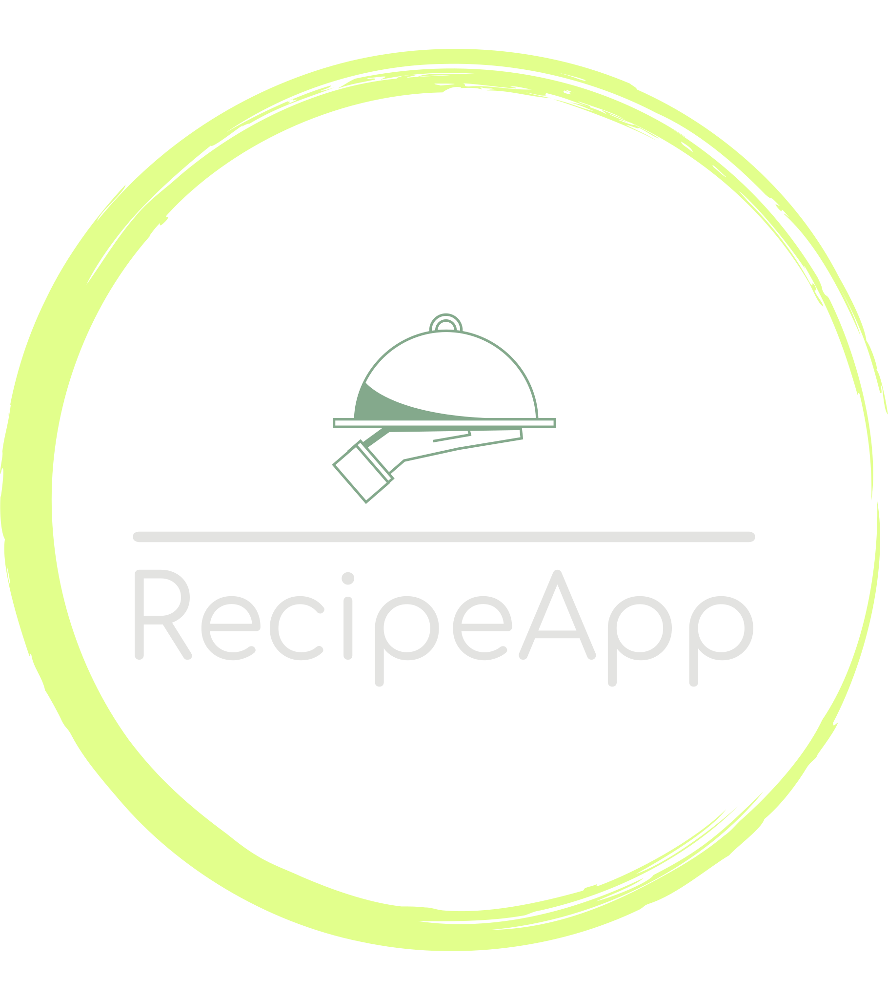

<div align="center">

<br>
<br>
<h1 align="center"><b>RecipeApp</b></h1>

[](https://react.dev/)
[](https://www.typescriptlang.org/)
[](https://redux-toolkit.js.org/)
[](https://react-hook-form.com/)
[](https://vercel.com/)

</div>


# React + TypeScript + Vite

Application is available at: https://recipeapp-sigma.vercel.app/

Test user credentials:
- email: zed@lol.com
- pass: zed123

<br>

# Content table
    1. Description
      - Key Features
    2. Libraries and Frameworks
    3. How to use project?
        - ENV
        1. SETUP DEV ENVIRONMENT
        2. BUILD PROJECT

<br>

# 1. :information_source: Description

The Recipe App is a versatile and user-friendly application that empowers you to manage your culinary creations effortlessly. Whether you're a seasoned chef or a cooking enthusiast, this app provides a seamless experience for creating, editing, and deleting your recipes. Unleash your creativity in the kitchen by documenting your favorite recipes with detailed instructions and ingredients.

### Key Features

- **Create Recipes:** Easily add and save your unique recipes, including step-by-step instructions and a list of ingredients.

- **Edit Recipes:** Modify your recipes at any time to keep them up-to-date with your latest culinary innovations.
- **Delete Recipes:** Remove recipes you no longer need or want to share, maintaining a clean and personalized recipe collection.
- **Browse All Recipes:** Explore a vast collection of recipes contributed by the community. Discover new ideas and cooking techniques to enhance your culinary skills.

Whether you're looking to organize your personal recipe collection or share your culinary expertise with others, the Recipe App offers a comprehensive solution for all your cooking needs.


# 2. :hammer_and_wrench: Libraries and Frameworks

This recipe app is built with a powerful stack of libraries and frameworks to ensure a seamless development experience and a robust user interface.

- **React (v18.2.0):** A declarative and efficient JavaScript library for building user interfaces. React provides a component-based architecture, making it easy to compose and maintain complex UIs.

- **TypeScript (v5.0.2):** A superset of JavaScript that adds static typing. TypeScript enhances code quality and developer productivity by catching errors early in the development process.

- **Vite (v4.4.5):** A fast, opinionated web development build tool. Vite provides a lightning-fast development server and efficient bundling, contributing to a snappy user experience.

- **ESLint (v8.45.0):** A pluggable and configurable linter tool for identifying and fixing problems in JavaScript and TypeScript code. ESLint ensures consistent and high-quality code.

- **Redux (v8.1.3) and Redux Toolkit (v1.9.7):** A predictable state container for JavaScript applications. Redux Toolkit simplifies state management and provides tools to write clear, maintainable Redux code.

- **React Hook Form (v7.48.2):** A flexible and efficient library for handling form state and validation in React applications. React Hook Form simplifies the development of dynamic and interactive forms.

These libraries and frameworks collectively form the backbone of the Recipe App, providing a solid foundation for a delightful user experience and efficient development workflow.


# 3. :computer: How to use project?

Clone [project](https://github.com/SemjanivNikola/recipeapp) from GitHub from your terminal:

> `git clone https://github.com/SemjanivNikola/recipeapp.git`

### **ENV**
   Before starting developmen server it is mandatory to create **.env.local** based on **.env.example** file and fill in the variables. Variables are URLs to backend API from where app data is fetched.

### 1. SETUP DEV ENVIRONMENT

Install dependencies using [npm](https://www.npmjs.com/):
```
npm install
```
Start dev server:
```
npm run dev
```
Or using [yarn](https://yarnpkg.com/):
```
$ yarn install
```
```
$ yarn run dev
```
Development URL: http://localhost:8080

### 2. BUILD PROJECT

Start build script with
```
$ npm run build
```
or
```
$ yarn run build
```